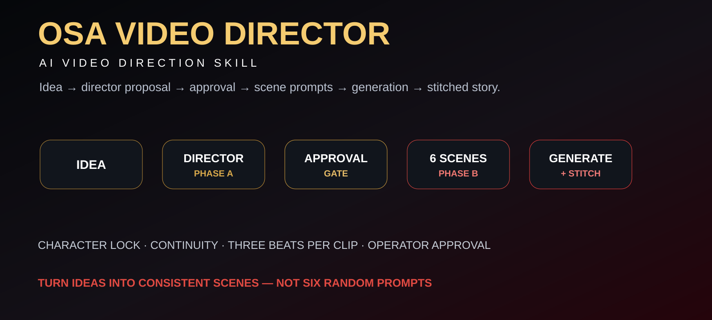
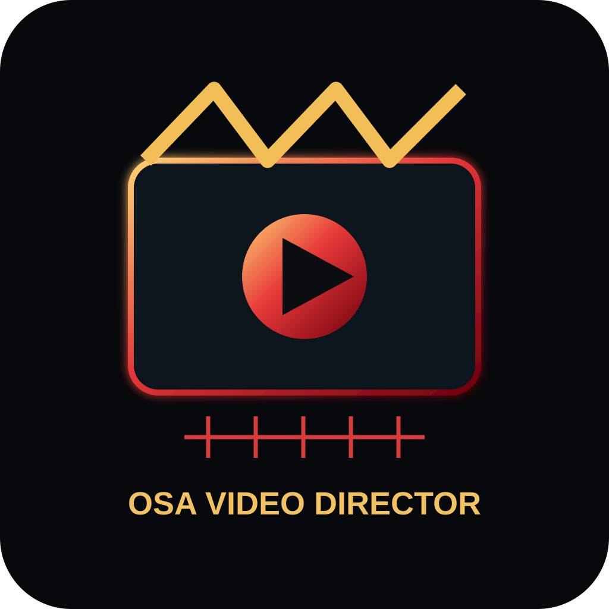
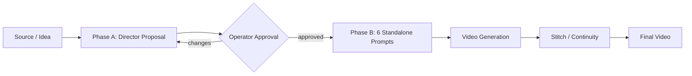

<p align="center"></p>
<p align="center"></p>

# OSA VIDEO DIRECTOR
### AI Video Direction Skill

> **Idea → director proposal → approval → scene prompts → generation → stitched story.**

`DIRECTOR` `STORYBOARD` `CHARACTER LOCK` `CONTINUITY` `6 SCENES` `APPROVAL GATE`

## Co to jest

OSA VIDEO DIRECTOR to skill reżyserski zamieniający temat, notatki, copy albo artykuł w spójny pakiet krótkiego wideo. Repo nie jest jeszcze pełnym render runtime; aktualny v0 skupia się na director workflow, character continuity i kontrakcie promptów.

Projekt rozwija własny OSA character system, motion language i continuity contract.

## System in one view



## Default format

```text
SOURCE
  ↓
PHASE A — DIRECTOR'S PROPOSAL
  ↓
OPERATOR APPROVAL
  ↓
PHASE B — 6 STANDALONE VIDEO PROMPTS
  ↓
GENERATION
  ↓
STITCH / FINAL VIDEO
```

Domyślnie: około **60 sekund**, **6 klipów × ~10 sekund**, po trzy beaty czasowe na klip (`0–3s`, `3–7s`, `7–10s`).

## OSA Character Lock

Każda scena musi utrzymywać m.in.:

- tę samą antropomorficzną Osę,
- stabilne proporcje ciała,
- dwie ręce, dwie nogi, dwa czułki i dwa skrzydła,
- spójny żółto-czarny pancerz,
- stałą geometrię skrzydeł i język mimiki,
- brak driftu gatunku / materiału / stylu.

Pełny kontrakt: [`skills/directing-osa-videos/references/osa-character-bible.md`](skills/directing-osa-videos/references/osa-character-bible.md)

## Repo map

```text
skills/
└── directing-osa-videos/
    ├── SKILL.md
    └── references/
        ├── osa-character-bible.md
        ├── storyboard-template.md
        ├── video-prompt-contract.md
        ├── osa-motion-language.md
        └── examples.md
```

## Example invocation

```text
$directing-osa-videos

Zrób 60-sekundową rolkę:
"Osa znajduje bounty za 10 000 USD i odpala RuntimeV2."

format: 9:16
styl: OSA Cyberpunk Dark
```

## Rules v0

- planowanie i komunikacja z operatorem: po polsku,
- prompty produkcyjne: domyślnie po angielsku,
- Phase B dopiero po approval gate,
- brak nieudokumentowanych claimów i liczb,
- każda scena musi wnosić czytelną zmianę,
- reference image ma pierwszeństwo nad luźnym opisem.

## Proof status

| Area | Status |
|---|---|
| Director skill | `IMPLEMENTED IN REPO` |
| Character bible | `IMPLEMENTED IN REPO` |
| Storyboard/prompt contracts | `IMPLEMENTED IN REPO` |
| Generator adapters | `PLANNED` |
| Automated stitching | `PLANNED` |
| End-to-end render proof | `NOT VERIFIED` |

**Status: v0 — character/system bootstrap.**
